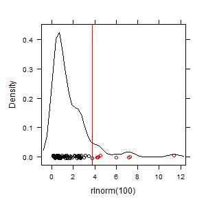

# hotspots

 

Identify statistically disproportionate “hot spots” in a set of data values 
(time or space). The method combines distributional deviance with relative 
magnitude, so only values that are both extreme *and* disproportionately large 
are flagged. 

## Install

**Stable from CRAN**

    install.packages("hotspots")

**Development from GitHub (latest commits)**

    # install.packages("remotes")  # if needed
    remotes::install_github("anthonydn/hotspots")

## Quick start

    library(hotspots)

    # simulate skewed data
    x <- rlnorm(100)

    # compute hotspots object (p = 0.99 by default)
    h <- hotspots(x)

    # visualize cutoff (red line) and flagged hot spots
    plot(h)

    # summary stats and cutoff (Ch)
    summary(h)

    # disproportionality (> 1 means hot spot)
    sort(disprop(h)$positive)

### Notes

- Increase skew or lower `p` (e.g., `p = 0.9`) to flag more hot spots:

      plot(hotspots(rlnorm(100, sd = 2), p = 0.9))

- Help pages:

      ?hotspots
      ?disprop
      ?plot.hotspots
      ?summary.hotspots

## Citation

Darrouzet-Nardi A., Bowman W.D. (2011). Hot spots logic described in *Ecosystems*.  
DOI: 10.1007/s10021-011-9450-x

Darrouzet-Nardi A. (2013– ). **hotspots**: Identify statistically disproportionate hot spots.  
CRAN: https://CRAN.R-project.org/package=hotspots

For a longer tutorial: http://anthony.darrouzet-nardi.net/hotspot_tutorial.html

## License

GPL-2
